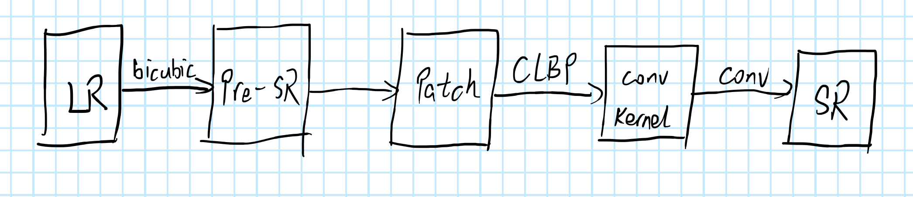
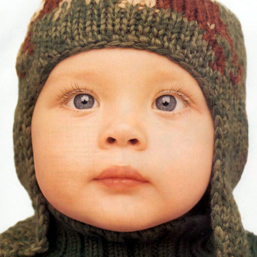
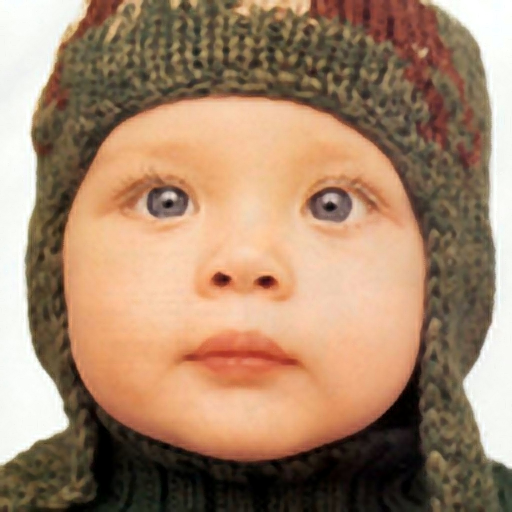

# 算法设计说明

## 背景介绍
单幅图像超分辨率重建是指将一副低分辨率图像通过特定算法处理获得高分辨率图像的的一种技术。图像超分辨率重建一直以来都是图像处理领域中一个重要的研究方向之一，在医学、遥感、图像识别、网络媒体传输、动画制作与合成等领域都有着重要的应用。目前以有很多优秀的算法应用于现实的产品上，但是有效保持图像纹理细节且使图像边缘区域不失真，同时兼顾处理速度一直是该图像超分辨率重建技术的一个难题。

在 GPU 处理领域，为了减轻像素引擎的负载，通常使用渲染低分辨率后经由算法放大至期望图像大小的方法已经成为一个被广泛使用的性能优化手段。实现一种对帧存颜色缓冲区图像的超采样处理 IP ,用于硬件性能不足时将低分辨率图像放大至高分辨率,从而在尽可能贴合高分辨率渲染效果的同时提升帧率、降低功耗。

## 赛题分析
在本赛题中，由于举办方提供的图像样例仅包含像素信息，缺失了渲染相关的运动信息、位置信息、光线信息等，故可将本赛题视作 Single Image Super Resolution(SISR) 任务。同时因为比赛方限制使用基于神经网络设计的算法，我们队伍将基于传统算法结合机器学习的方法进行图像超分辨率核心算法设计。

## 算法分析
### 下采样模型概括
在 SISR 任务中，实际上是完成了一个对低分辨率输入图像 LR 进行高分辨率图像 HR 的预测过程。图像的线性退化模型可以表示为：
$$
z=D_sHx + n\tag{1}
$$
其中，$z$ 为输入大小为 $M*N$ 的 LR 图像；$x$ 为大小是 $Ms*Ns$ 的待预测 HR 图像；$H$ 是线性模糊核；$D_s$ 为下采样算子，系数 $s$ 是下采样的倍数； $n$ 为额外的噪声。图像超分辨率的任务就是通过 $z$ 恢复出未知的 HR 图像 $x$。由于在退化模型照中，下采样操作会带来信息损失，同时随着下采样倍数 $s$ 增大，LR 所包含的 HR 信息丢失越多。在这过程中，HR 与 LR 的对应是多对一的关系，完成超分辨率任务则变成了求解一个欠定的逆问题，即求得结果可能产生多个输出。因此需要引入先验信息，通过约束获得唯一解。

在本次赛题中，由于给出的测试集为 GPU 渲染图片的4倍线性下采样图，公式1中的线性模糊核 $H$ 则可以消去，同时假设没有引入来自其他的噪声干扰，则公式中噪声 $n$ 也可消去。最终得出得出公式2。
$$
z=D_sx\tag{2}
$$

### 双三次插值算法介绍
在数值分析这个数学分支中，双三次插值(Bicubic)[[10-11]](#参考文献)是二维空间中最常用的插值算法，是三次插值的一个拓展。而在图像处理中，双三次插值算法更是首选。双三次插值需要参考下周围16个像素($4 \times 4$)进行上采样，结果图像会比最近邻插值和双线性插值更平滑，因插值造成的伪影也更少。

作为一个整体，双三次插值算法需要计算插值像素中心与原始像素中心之间的距离。然后通过具有距离的双三次插值函数计算相关系数，然后使用该系数与原始像素点相乘，最终与16个原始像素点的乘积之和就是新的插值像素点结果。可以简单的看作新插值点与原始像素点对应的曼哈顿距离加权，可以用以下公式表示。
$$
SP_{\vec{s}}=\sum_{\vec{o}\in{RSB}}f_B(\vert\vec{s}-\vec{o}\vert)\cdot OP_{\vec{o}}\tag{?}
$$
$$
f_B(|x|)=
\begin{cases}
    (\alpha + 2)|x|^3-(\alpha+3)|x|^2+1\quad &,if\ |x| \leq1\\
    \alpha|x|^3-5\alpha|x|^2+8\alpha|x|-4\alpha\quad&,if \ 1<|x|<2\\
    0&,otherwise
\end{cases}\tag{?}
$$
其中，$SP_{\vec{s}}$ 为插值后像素，$\vec{s}$ 是对应的索引向量。$RSB$ 为当前插值像素所在的插值块对应的原始像素的索引集合。$OP_{\vec{o}}$ 为原始像素，$\vec{o}$ 是对应的索引向量。$f_B$ 则是双三次插值的核心函数。

由于双三次插值算法在我们算法设计中为预处理部分，我们进行了针对于硬件设计的大量优化，具体请参考文档 APV21B-Bicubic Super-resolution IP 介绍，此处不展开介绍。

### 高斯-拉普拉斯算子介绍

### 局部二值模式特征提取算法介绍

### RAISR介绍
#### Overview
Google 在 2016 年提出了 **RAISR**[[1]](#参考文献) 算法，一种基于样本学习的超分辨率算法。RAISR 主要的特点是快速、准确，在运行速度上比基于深度学习的方法有大幅提升，同时保持了具有竞争力的图像重建质量。其核心思想是通过简单的插值方式把 LR 图像转化成 Pre-HR 图像，然后根据 Pre-HR 图像局部的梯度信息来对图像块进行分类，对于不同类别的图像块对应采用不同的与训练的滤波器进行卷积操作对图像纹理进行增强。在足够的训练数据下，通过学习一组滤波器建立成对的 LR patch与 HR 像素的映射关系。

RAISR 将 patch 分为了216类并结合 $R^2$ 个像素类型 (R为上采样因子)，这其中包括了 3类像素强度、24类纹理角度、3类图像快相关性。因此，当上采样因子 $R$ 为4时，便需要 3456 个大小为 11 x 11 的滤波器。通过哈希映射的方式将 patch 分类到不同类别中，而不需要使用较为复杂的聚类方式如K-means[[2]](#参考文献)、或者是高斯混合模型[[3]](#参考文献)，从而降低分类查找时间。在 RAISR 中，哈希表键值是通过估计 patch 的局部梯度统计来获得。接下来我们会分析 RAISR 的一些具体实现。

#### 哈希表键计算方法
通过特征分析[[6]](#参考文献)来计算用作哈希表键的图像块的局部梯度特征。第 $k$ 个的最近领域通常是一个 $\sqrt{n}*\sqrt{n}$ 的 patch，其中，像素包含于 $k_1,...,k_n$。每个图像块的局部梯度特征放置在一个 $n \times 2$ 的矩阵中：
$$
G_k=
\left[
    \begin{matrix}
    {g_{x_{k_1}}} & {g_{y_{k_1}}}\\
    \vdots & \vdots\\
    {g_{x_{k_n}}} & {g_{y_{k_n}}}
\end{matrix}
\right]
\tag{3}
$$
在特征分析[[6]](#参考文献)中，局部梯度特征可以通过奇异值分解SVD进行计算。求解出来的右向量表示为该图像块的梯度方向，两个奇异值用于表示梯度的强度和相关性。通过一个可分离的归一化高斯核构建了一个对角矩阵 $W_k$ ，用于简化特征值分解。根据 $G_k^TW_kG_k$ 矩阵的特征分解得到较大的特征值 $\lambda_1^k$ 、较小的特征值 $\lambda_2^k$ 和两个特征向量 $\phi_1^k$ 和 $\phi_2^k$，用来表示梯度的强度 $\lambda_k$、角度 $\theta_k$ 和相关系数 $\mu_k$，其中
$$
\lambda_k=\lambda_1^k\tag{4}
$$
$$
\theta_k=\arctan(\frac{\phi_{1,y}^k}{\phi_{1,x}^k})\tag{5}
$$
$$
\mu_k=\frac{\sqrt{\lambda_1^k}-\sqrt{\lambda_2^k}}{\sqrt{\lambda_1^k}+\sqrt{\lambda_2^k}}\tag{6}
$$
这三个哈希表键量化后可以用 $\lambda$，$\theta$， $\mu$ 来表示，其中
$$
\lambda=\lceil\frac{\lambda_k}{Q_s}\rceil\tag{7}
$$
$$
\theta=\lceil\frac{\theta_k}{Q_\theta}\rceil\tag{8}
$$
$$
\mu=\lceil\frac{\mu_k}{Q_\mu}\rceil\tag{9}
$$
在以上公式(7-9)中，$Q_s$、$Q_\theta$、$Q_\mu$ 分别代表了强度、角度和相关系数的量化因子。通过这三种参数，构建了216个哈希键映射分类。
#### 滤波器学习
在 RAISR 的学习阶段，需要通过建立一个 LR 图像块与 HR 像素点映射的训练数据集，用于学习一个 $d\times d$ 的滤波器 $h$。滤波器可以通用求解最小二乘法最小值来计算：
$$
h=\min_h\sum_{i=1}^L\lVert{A_ih-b_i}\rVert_2^2\tag{10}
$$
其中，$h$ 是一个 $d^2 \times 1$ 向量表示学习的滤波器，$A_i$ 是由 Pre-SR 图像 $y_i$ 中提取图像块 $d\times d$ 后组成的大小为 $MN\times d^2$ 矩阵，$b_i$ 是由 HR 图像 $x_i$ 中提取的像素点所构成，对应 $y_i$ 图像块的中心坐标。

在论文[[1]](#参考文献)，作者为了降低求解滤波器的运算量和数据存储，拓展了公式(10)：
$$
h=\min_h\lVert Qh-V\rVert_2^2\tag{11}
$$
其中 $Q=A^TA$，$V=A^Tb$。经过这样的转换可以降低数据存储空间以及求解时候的运算，可以表示为
$$
Q=A^TA=\sum_{i=1}^LA_i^TA_i\tag{12}
$$
$$
V=A^Tb=\sum_{i=1}^LA_i^Tb_i\tag{13}
$$
其中，$Q$ 是一个 $d^2 \times d^2$ 的小矩阵和 $V$ 是一个 $d^2 \times 1$ 的列向量。到此滤波器的学习就此结束。

#### CT 变换
由于在学习滤波器的时候会引入锐化操作，在使用该滤波器应用于简易插值后的图像，可能会引起结构变形。为了保留重要的结构，作者引入了 CT变换[[7]](#参考文献)，作用于简易插值后的图像与滤波后的图像。具体变换如图所示，

通过一个 $3\times 3$ 的图像块的周围像素与中心像素构建出一个布尔比较。然后以汉明距离来计算每个像素的变化位数。用于结构的变化是取决于汉明距离的，因为可以根据变化的位数来确定权重用于加权插值图像与滤波图像，从而得到输出图像。至此，RAISR 的核心设计思路已经清晰。

## Proposed Method
通过上节我们可以看到，RAISR 作者对于滤波器的学习以及应用进行了不少的优化，但是对于我们将该算法应用到硬件实现上，有着不小的挑战。第一个是在于，每个像素类型需要学习216个滤波器，而整幅图像可分为了16种类型，总共就需要3456个滤波器进行片上存储。在 FPGA 上存储如此大量的数据是不划算的。第二点是，为了能获得像素更多的信息，RAISR 采用了 $11\times11$ 大小的滤波器进行卷积，这对于硬件资源消耗量极大，在考虑量化同时保留运算过程中数据合适位宽并满足运算时延，至少需要180个DSP进行乘累加运算，总延时至少12个时钟周期输出延迟。第三点，哈希表键的运算不仅需要进行除法、开方及反正切运算，还需要进行奇异值分解，这对于 FPGA 实时性设计要求难度提升了一个等级。

### Overview
我们提出了一个创新的 **LBP-RAISR** 算法，以 **RAISR** 为主体框架，整体上分为了三个阶段。第一步，通过双三次插值算法[[4-5]](#参考文献)，将 LR 图像映射到 HR 图像上，得到最终需要的分辨率；第二步，遍历 Pre-HR 图像的每一个图像块，进行高斯-拉普拉斯(LoG)纹理检测后使用CLBP算法[[8-9]](#参考文献)进行纹理分类。显而易见，这里我们的设计与 **RAISR** 有较大的区别，这是由于硬件设计的考虑，会在下一节和 RTL设计 文档中详细解释。第三步，利用上一步的得到每个图像块的类型找到对应的滤波器，作用于图像块，得到更接近于原始 HR 的像素，最后得到更高质量的 SR 图像。整体框架如下图1所示。

### Step 1: Bicubic Interpolation
作为第一步，我们需要将 LR 图像先上采样到需要的分辨率，可以使用传统的插值方法如最近邻插值、双线性插值、双三次差值、Lanczos插值等算法。由于考虑到上采样图片的质量效果会应影响到最终的高分辨率图片质量与运算过程中的复杂度，双三次插值成为了我们算法预处理的选择。

### Step 2: Texture Classification
我们对经过4倍上采样后的 Pre-SR 图片进行高斯-拉普拉斯滤波(LoG)[[12]](#参考文献)，然后确定一个阈值区间进行二值化操作，采用 CLBP 算法对二值化后的图像纹理进行按块分类。这里需要注意的是，我们采用 $5 \times 5$ 的图像块进行纹理分类，由于已经对图像块进行了纹理检测这一操作，所以 CLBP 算法步骤我们并没有严格执行，保留 $C$ 中心像素与 $u$ 统一编码这两个参数, 考虑到该算法需要对圆形区域检测需要进行三角函数进行运算，我们将其近似等效为最外边缘的二值像素，从而减轻运算量。但是 CLBP 算法经过统一编码后具有旋转不变形，与滤波器需要学习局部纹理方向角度特征相矛盾，故此我们增加了一步操作，当进行对像素统一编码时，保留了角度信息，用于增加选择滤波器参数条件。此时，纹理分类结束。

### Step 3: Convlution
在上一步中我们已经通过纹理分类得到了图像块的纹理类型，根据这个类型我们可以选择预学习的滤波器，对相应的 Pre-SR 图像块进行卷积操作，从而得到了 SR 像素，最终输出 SR 图像。

## 实验
我们将提出的算法与 raisr 进行了对比

GTbicubic

raisrlbp-raisr 

GTbicubic

raisrlbp-raisr

| DataSet | Scale | Bilinear | Bicubic | RAISR | LBP-RAISR | LBP-RAISR(Quantized) |
|:---:|:---:|:---:| :---: | :---:|:---:|:---:|
| Set5(PSNR) | x4 | 25.79 | 26.84 | 27.05 | **27.61** | 27.50 |
| Set5(SSIM) | x4 | 0.765 | 0.790 | 0.803 | **0.812** | 0.808 |
| Set5(LPIPS) | x4 | 0.335 | 0.310 | 0.269 | **0.192** | 0.196 |
| GameSet(PSNR) | x4 | 30.83 | 31.51 | 31.59 | **31.85** | 31.70 |
| GameSet(SSIM) | x4 | 0.847 | 0.862 | 0.861 | **0.870** | 0.865 |
| GameSet(LPIPS) | x4 | 0.288 | 0.265 | 0.263 | **0.210** | 0.216 |

其中 Set5 是单帧图像超分辨率任务中最常用的数据集，GameSet 是景嘉微在本次杯赛中提供的测试效果图片。

## 总结
基于 RASIR[[1]](#参考文献) 的整体思路，我们提出了改进的 LBP-RAISR 算法。LBP-RAISR 背后的核心思想与 RAISR 相同，都是学习从 LR 图像到 HR 版本的映射关系，增强简单插值图像质量。映射是通过使用一组过滤器过滤 LR 图像的简单插值放大版本来完成的，这些过滤器旨在最小化输入图像和真实图像之间的欧氏距离。更具体地说，LBP-RAISR 使用了一种更简便快捷的纹理分类方法，从存储空间上和运算量上做了大量的优化，同时也保留了图像质量的效果。根据实验结果，可以较好的提升 RAISR 的性能以及运算时间。同时经过量化后适配 硬件设计并有损失太大的图像质量。由于我们采用的是 LBP 进行纹理分类，与 RAISR 中的哈希映射方法相比较，进一步减少了运算量，同时选择滤波器的方法是固定的，对于硬件上实现是高效便捷的。从更广泛的角度来看，我们希望 LBP-RAISR 作为学习到的滤波器映射与训练集的关联影响并不大，在这种情况下，学习的过滤器可以用于为任意输入图像进行 x4 的超分辨率图像输出。同时由于运算量的大大降低，让高分辨率图像进行实时的超分辨率任务也是可能的。

## 参考文献
1. Romano, Yaniv, John Isidoro, and Peyman Milanfar. "RAISR: rapid and accurate image super resolution." IEEE Transactions on Computational Imaging 3.1 (2016): 110-125.
2. Jeong, S. C.; Song, B. C. Training-based superresolution algorithm using k-means clustering and
detail enhancement. In: Proceedings of the 18th European Signal Processing Conference, 1791–1795, 2010.
3. Yu, G. S.; Sapiro, G.; Mallat, S. Solving inverse problems with piecewise linear estimators: From Gaussian mixture models to structured sparsity. IEEE Transactions on Image Processing Vol. 21, No. 5, 2481–2499, 2012
4. R.G. Keys, “Cubic convolution interpolation for digital image processing,” IEEE Transaction on Acoustics, Speech and Signal processing, vol. 29, no. 6, Dec. 1981, pp. 1153-1160.
5. H.S. Hou and H.C. Andrews, “Cubic splines for image interpolation and digital filtering,” IEEE Transaction Signal processing, vol. 26, no. 6, Dec. 1978, pp. 1153-1160.
6. X. Feng and P. Milanfar, “Multiscale principal components analysis for image local orientation estimation,” Proceedings of the 36th Asilomar Conference on Signals, Systems and Computers, Pacific Grove, CA, November 2002. 5
7. Zabih, R.; Woodfill, J. Non-parametric local transforms for computing visual correspondence. In: Computer Vision — ECCV ’94. Lecture Notes in Computer Science, Vol. 801. Eklundh, J. O. Ed. Springer Berlin Heidelberg, 151–158, 1994.
8. T. Ojala, M. Pietikainen and T. Maenpaa, "Multiresolution gray-scale and rotation invariant texture classification with local binary patterns," in IEEE Transactions on Pattern Analysis and Machine Intelligence, vol. 24, no. 7, pp. 971-987, July 2002, doi: 10.1109/TPAMI.2002.1017623.
9. Z. Guo, L. Zhang and D. Zhang, "A Completed Modeling of Local Binary Pattern Operator for Texture Classification," in IEEE Transactions on Image Processing, vol. 19, no. 6, pp. 1657-1663, June 2010, doi: 10.1109/TIP.2010.2044957.
10. R. Keys, “Cubic convolution interpolation for digital image processing,” IEEE Trans. on Acoustics, Speech and Signal Proc., vol. 29, no. 6, pp. 1153–1160, 1981. 1
11. H. Hou and H. Andrews, “Cubic splines for image interpolation and digital filtering,” IEEE Trans. on Acoustics, Speech and Signal Proc., vol. 26, no. 6, pp. 508–517, 1978. 1
12. R. Haralick and L. Shapiro Computer and Robot Vision, Vol. 1, Addison-Wesley Publishing Company, 1992, pp 346 - 351.