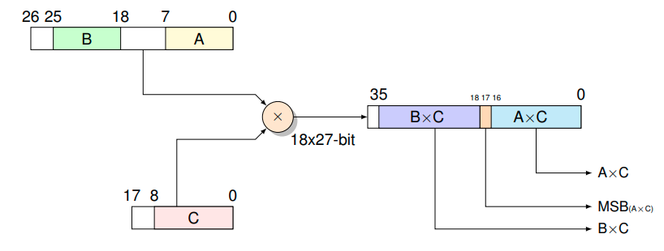
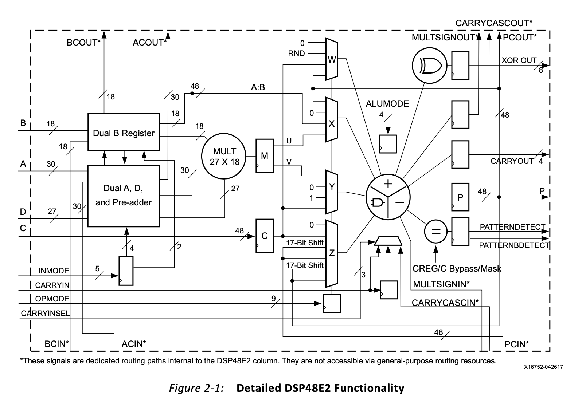

# RTL设计文档

## Overview
上采样 IP 设计采用了模块化设计，主要分为三大部分：
1. Bicubic 上采样模块；
2. 纹理分类模块；
3. 自适应锐化模块。

## Bicubic 上采样模块
具体说明详见附件文档 [APV21B_Bicubic_Super_Resolution_IP_UM](#../APV21B_Bicubic_Super_Resolution_IP_UM.pdf) 第四部分具体设计结构。

## 纹理分类模块
纹理分类 IP 可提供对于单通道图像每个 $5\times5$ 或 $3\times3$ 图像块的纹理特征进行实时分类。包含了一个归一化高斯卷积核、一个标准拉普拉斯算子、一个纹理分类器、三个行缓冲模块和一个控制单元。为了确保卷积操作后仍需令图像保持原始尺寸，行缓冲模块包含了图像填充处理操作与数据映射模块，由控制单元进行管理。

### 运算位宽与量化
为了节省片上资源的消耗，最大化提升 DSP 利用率，在本模块中，不同部分对于 DSP48E2 均有不同程度上的优化。其中，针对高斯滤波卷积中，将核内权重进行9位无符号量化，在保证高斯卷积核性能的同时充分利用了 DSP48E2 单元的乘法器。这种量化方法仅支持8位图像输入。另外，为了保证后续拉普拉斯滤波数据误差尽可能降低，我们将高斯滤波后的数据量化为20位，尽可能保留数据位宽，避免引入过大误差影响后续操作。在完成拉普拉斯算子卷积后生成的是1位图像输出至 LBP 分类器。

### 高斯卷积核
高斯卷积核包含了一个高斯系数寄存器单元、一组并行乘法器单元、一组并行的累和单元、一组并行舍入单元.

每个像素进行高斯滤波卷积是以像素本身为中心，边缘 $5\times5$ 的像素块作为数据输入。每个像素块需要与对应的高斯系数进行相乘然后累和。该高斯卷积核 IP 每个时钟周期处理4个像素。

#### 高斯系数寄存器单元
高斯滤波卷积核系数是由 $\delta$ 所决定，在运行过程中， $\delta$ 不会发生改变，所以该系数为常数。同时，$5\times5$ 卷积核系数与所在卷积核的位置有关系，并且成对应关系。25个系数只需要存6个系数即可。

#### 乘法器单元
并行乘法单元包含了7个 DSP48E2 用于实现 $5\times5$ 大小的卷积乘法操作。在两个时钟周期后可输出结果(一周期内也可实现结果输出，但为了提升 IP 最大时钟频率，输出端插入一级寄存器增大时序违例余量)

由于高斯系数具有对称性，当计算图像块对应的位置的时候，存在几对像素所相乘同一个高斯权重系数。例如上图(0,0)、(0,4)、(4,0)、(4,4)对应像素均是乘以同一个系数。因此，我们可以利用这一特性，并结合 DSP48E2 的大位宽乘法器，同时进行两个8位数据乘以一个9位权重，并保留完整位宽输出。具体设计分析可以查看[APV21B_Bicubic_Super_Resolution_IP_UM](#../APV21B_Bicubic_Super_Resolution_IP_UM.pdf) 第四部分Biubic设计详细解释中的乘加单元(MA Unit)介绍。

#### 累和单元
并行累和单元包含了12个 DSP48E2 用于实现25个数的累和操作。在六个时钟周期后可输出结果。

$$
result = \sum_{i=0}^{24}A_i
$$

这是一个 DSP48E2 内部架构图。

我们可以看到，在 DSP48E2 内部，有两个可以实现加法的环节，第一个 A 与 B 进行乘法之前，有一个相对较小位宽的加法器，另外一个是在 A 与 B 乘法之后一个较大位宽的加法器。我们可以利用这两个加法器实现在一个 DSP48E2 内完成三个数累和，两个时钟周期后输出。

于是，我们可以基于这一个3输入1输出加法器搭建一个具有三级的25输入1输出的加法器单元，结果将会在六个时钟周期后输出。

其中需要注意的两个点，第一，我们充分利用了 DSP48E2 内的寄存器资源，以便提升该 IP 最大能达到的时钟频率；第二，我们尽可能的利用上了 DSP48E2 的位宽，保证数据运算时不会因为引入误差而影响后续运算。

#### 舍入单元
并行舍入单元是通过判断后截断位数的低一位是否为1进行简单的四舍五入运算，可以直接通过一个 DSP48E2 完成该操作。由于输入数据与权重数据均是经过量化的，定点位数进行四舍五入是简单的操作。舍入运算均会在两个时钟周期后输出结果。

### 拉普拉斯卷积核
拉普拉斯卷积核包含了一组并行的累和单元、一组并行比较单元。

在拉普拉斯卷积核中，我们使用4个 DSP48E2 进行9数累和运算。每个像素进行拉普拉斯滤波是以像素本身为中心，边缘 $3\times3$ 的像素块作为数据输入。每个像素亏需要与对应的拉普拉斯系数进行相乘然后累和。该拉普拉斯卷积核 IP 每个时钟周期处理4个像素。

可以看到，拉普拉斯算子中心为 -8，边缘为 1 的权重分布。所以我们直接利用累和完成 9 数累和。其中中心像素我们直接对像素值的低位补3个0操作，同时将它所传入的 DSP48E2 的加法器设置为减法操作即可。该拉普拉斯卷积核可在四个时钟周期后输出结果。

需要注意的是，在高斯卷积与拉普拉斯卷积中均使用了 **3输入1输出** 累和模块，但此时拉普拉斯使用时需要将输入数据转换为有符号数再进行运算。当数据位宽拓展时，需要注意高符号位选择。

### 纹理分类器
纹理分类器主要包含了四个部分：一个区域划分模块、一个统一编码模块、一个角度编码模块以及一个地址编码模块。

纹理分类单元每个时钟周期处理一个 $5\times5$ 经纹理检测后的二值图像块。经过一个时钟周期后输出纹理分类对应滤波器地址。

#### 区域划分模块
区域划分模块主要将后续进行统一编码与角度编码的像素区域进行提取。

其中，对于边缘信息输出的16位数据按图像块顺时针提取，输出数据的第0位为像素块对应的(0,0)，第1位为像素块的(0,1)以此类推。

#### 统一编码模块
统一编码模块用于对边缘区域的像素进行统一编码。我们可以将16位的边缘像素数据看作一个环形队列。然后对其按照顺时针的顺序进行边沿检测。

可通过公式表示。
$$
F=P_{0}\oplus P_{15} + \sum_{i=0}^{14}P_i \oplus P_{i+1} \tag{?}
$$

这里我们举一个简单的例子。黑色 0-1 数字代表了像素的数据，蓝色数字代表了该像素数据原本所在边缘数据的位置。每一位数据与它对应的下一位数据进行异或操作。异或结果使用了红色数字进行表示。其中 1 代表检测到边沿跳变，0 代表没有边沿跳变。

边缘像素数据异或运算后的结果通过计数 1 的个数，则为我们最终需要的跳变次数 $F$，编码为 0-16 中的偶数。

在进行边沿检测的时候，同时会统计边缘像素数据中1的个数 $N$。

当跳变次数 $F$ 为0时，统一编码结果输出为0；当跳变次数 $F$ 为2时，统一编码结果输出为 %N%，其中 $N$ 为 整数 1-15；当跳变次数 $F \geq 4$ 时，统一编码结果输出为16。

对于16个1比特统计个数，我们将其拆分为 4 个 4输入1输出 的查找表与 1 个 4输入1输出 的小位宽加法器。由于这里进行的数据运算皆是小位宽，我们设计的加法器直接使用查找表进行实现。

#### 角度编码模块
角度编码用于对边缘区域的像素进行角度编码。我们可以将16位的边缘像素数据看作一个环形队列。然后对其按顺时针的顺序进行上升沿检测。

这里与统一编码模块的检测边缘思路一致，但在该模块中我们检测的是边缘数据下降沿跳变的位置。然后对于这16位的独热码进行提取1的位置，其结果为我们所需要的角度编码，结果为 0-15。

此处需要注意的是，由于我们角度编码产生的结果有效是建立在统一编码结果为2的基础，如果统一编码为其他结果，角度编码输出则为0。同时，当数据经过统一编码后输出为2时，该数据进行角度编码的结果输出必然是独热码。

#### 地址编码模块
地址编码模块通过接收来自统一编码模块、角度编码模块与二值像素块中心像素的信息，进行地址编码，用于查找该像素块纹理特征类别的滤波器地址。

由于统一编码的结果可以分为三种情况，第一种情况为特殊的全0或全1，第二种情况为统一编码为16，第三种情况为统一编码结果为1-15。在第一种和第二种情况中，我们不考虑角度编码信息，默认置0。结合中心像素信息，会产生四个对应的地址。在第三种情况中，我们直接将中心像素信息、统一编码信息与角度信息拼接一起，输出为9位的地址。

注意，在统一编码的三种情况下，第一、二种情况占用了第三种情况的部分地址，但由于第三种情况不会出现编码为0的结果，所以在访问地址上并不冲突。

### 行缓冲模块
在纹理分类模块中，一共使用了三个行缓冲单元，其中包含两个五行缓冲单元以及一个三行缓冲单元。

每个行缓冲模块用于对输入数据进行缓冲，从而实现为后续计算同时输出三行数据；同时在缓冲时可以由控制信号进行像素填充操作。

缓冲模块的接口可以配置为 AXI4-Stream 接口，方便模块调用。注意，在纹理分类模块内部中，为了减少信号线扇出，仅保留数据总线与数据有效信号。

#### 三行缓冲单元
三行缓冲单元由三个 FIFO 级联形成，读写信号由控制单元进行控制；输出数据连接至输出映射控制器，由控制单元控制，用于实现填充像素功能。

**缓冲与运行**  当图像的第一行数据流入 FIFO 时，第一行数据保留在第一行 FIFO 进行缓冲不输出；当第二行数据开始流入 FIFO 时，会流入第一行 FIFO，原本处于第一行 FIFO 的数据开始流向第二行 FIFO，此时仍处于缓冲模式；当第三行数据到来，会流入第一行 FIFO，原本在第一行 FIFO 的数据会流入第二行 FIFO，原本在第二行 FIFO 的数据会流入第三行 FIFO。同时，当第三行数据到来，由于算法上需要进行像素填充操作，所以可以开始进行缓冲数据流出用于后续运算；当最后一行流入的数据完全进入第三行 FIFO 时，该帧图像缓冲结束。

需要注意的是，刚开始运算像素行的数据仅由第一行 FIFO 与第二行 FIFO 提供，具体表现为第一、二行 FIFO 输出数据有效，第三行 FIFO 输出数据为无效；当最后运算像素行的数据仅由第二行 FIFO 和第三行 FIFO 提供，具体表现为第二、三行 FIFO 输出数据有效，第一行 FIFO 输出数据无效。

**输出映射**  在输出映射模块中，主要完成像素行输入填充的映射以及列填充。具体映射规则由控制单元控制。

当需要进行上边缘填充的时候，将进入的两行像素中的上边缘像素行映射到另外一个输出端口中即可。下边缘填充同理。

当需要进行左边缘填充的时候，将进入的两行的首像素进行重复输出即可，具体操作由控制单元控制该行 FIFO 读时，仅对输出数据置为有效位，下一个时钟周期再弹出该像素。右边缘像素填充同理。

**控制单元**  主要实现了对 FIFO 进行读写控制，以及输出映射的模式选择。其核心为一个计数器单元，计数输入流有效数据个数。

需要注意的是，上述设计介绍均基于每时钟周期处理一个像素。实际上设计的模块运行在每时钟周期处理四个像素。FIFO 每次缓冲从1个像素 $N$ 比特数据变为个像素 $4N$ 比特输入，输出为四路像素阵列至对应的四个运算单元。在 FIFO 与 输出映射单元数据通路间会插入一级寄存器，用于暂存后续需要使用到当前周期的像素。具体表现为将该寄存器数据经过多路选择模块进入输出映射单元。

#### 五行缓冲单元
五行缓冲单元由五个 FIFO 级联形成，读写信号由控制单元进行控制；输出数据连接至输出映射控制器，由控制单元控制，用于实现填充像素功能。

具体设计细节可参考三行缓冲单元设计，五行缓冲单元为其拓展设计，设计思路与其一致。

## 自适应锐化模块
自适应锐化模块可进行对于不同 $5\times5$ 的图像块根据其纹理特征进行实时锐化。该 IP 包含了一个 $5\times5$ 卷积单元、一个滤波器参数存储单元以及一个行缓冲模块。为了确保卷积操作后仍使图像保持原始尺寸，行缓冲模块包含了图像填充处理操作与数据映射模块，由控制单元进行管理。滤波器存储单元用于存储不同纹理类型的锐化参数，为图像锐化卷积提供权重数据。

